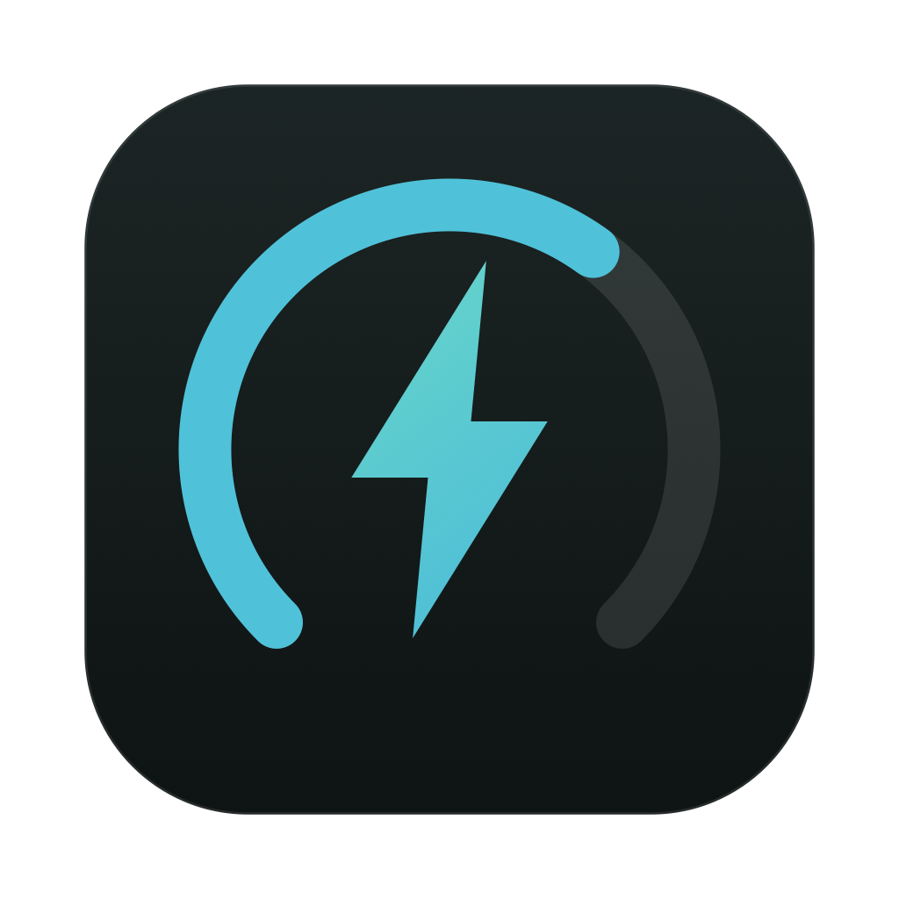

<div align="center">



# Smart Charging

**Your charger says 100 W. You're probably getting 60.**

A macOS menu bar app that shows what your charger is *actually* delivering,
and names which part of the chain is holding you back.

</div>

---

macOS says *Charging* while the battery goes down. It never mentions that your
cable capped you at 60 W, or that the port you picked is the slow one.

Same Mac, same cable, same charger — only the port changed:

| Port | Delivered | Rail | Cable ceiling |
|------|----------:|-----:|--------------:|
| C1 | **140 W** | 28 V | 4990 mA |
| C2 | 100 W | 20 V | 4990 mA |
| C3 | 30 W | 12 V | 2480 mA |

A 110 W swing, with no warning anywhere.

## Install

```bash
brew install --cask bluehawana/tap/smartcharging
```

Or download the [signed disk image](../../releases) and drag it to
Applications. Notarised by Apple, so it opens without a Gatekeeper warning.

Requires macOS 14+. Apple silicon and Intel.

## What it does

- **Live wattage in the menu bar.** Close the window and it keeps measuring.
- **Names the cause, not just the number.** 60 W and 65 W are one watt apart
  and completely different problems.
- **Catches silent downgrades.** Remembers the best your charger has offered,
  so moving to a slower port does not go unnoticed.
- **Tracks battery health.** Heat, time spent full, and the charge cycling a
  borderline supply causes.

## One reading from the terminal

```bash
SmartCharging --probe
```

```
Delivered        100 W
Cable ceiling    4990 mA
Battery flow     -21.39 W
System draw      ~121 W  (adapter saturated)
```

Real: a 16-inch MacBook Pro running a 27B model under oMLX, pulling 121 W
against a 100 W supply.

## Reading the numbers yourself

The rail and the current together name the cause — the wattage alone cannot:

- **3000 mA on a full 20 V rail** → the cable has no e-marker chip
- **A low rail** (12 V, 15 V) → the port, or a hub in the way
- **28 V** → PD 3.1, which no other rail reaches

```bash
ioreg -rn AppleSmartBattery | tr ',' '\n' | grep -E '"(Watts|Current)"='
```

## More

- [The long version](docs/DETAILS.md) — how this started, what each reading
  means, cable reference, and what is measured vs inferred
- [Releasing](RELEASING.md) — signing, notarisation, and the Homebrew cask
- [Working diary](docs/working-diary.md) — the debugging, including the wrong
  turns

Built from a real problem: a laptop draining while plugged in, running a local
model. Readings come from the `AppleSmartBattery` sensor. No elevated
privileges, no network, nothing leaves the machine.

MIT licensed.
