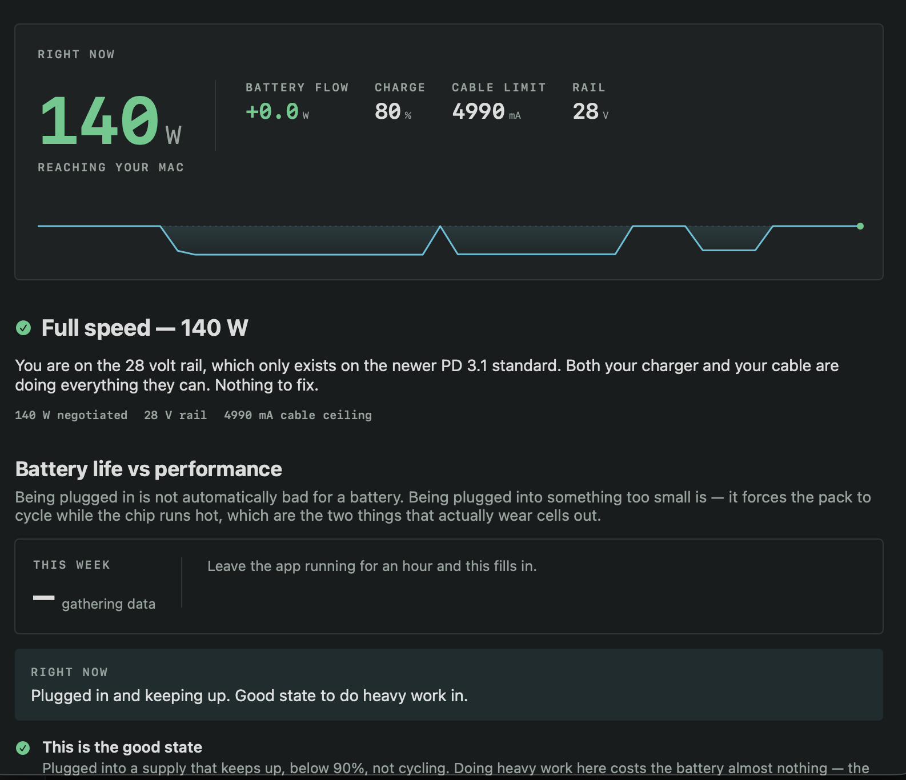
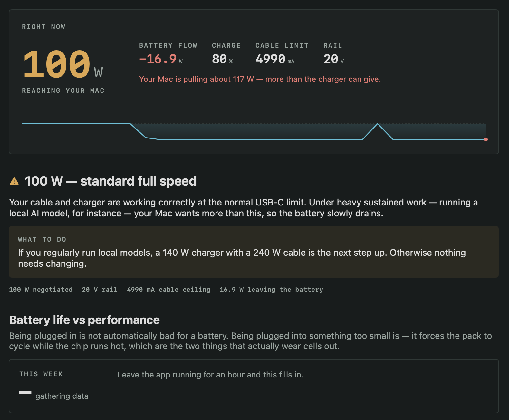
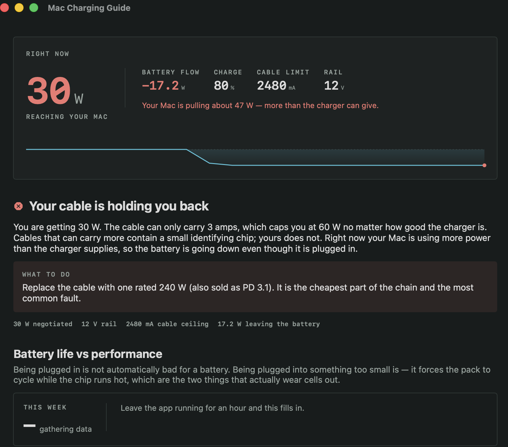
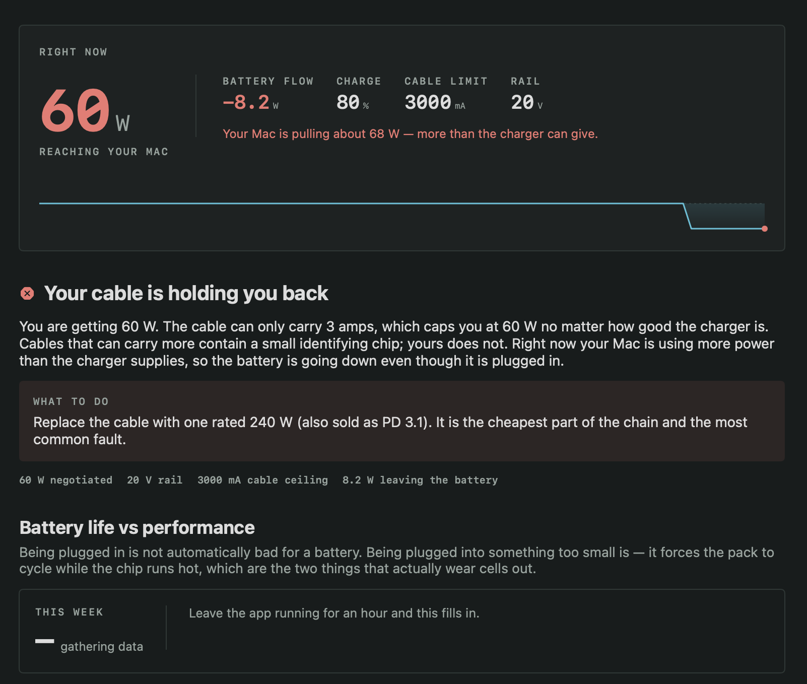

# Smart Charging — the long version

The full story, the measurements behind it, and how to read the numbers
yourself. For installation and a two-minute summary see the
[README](../README.md).

Your Mac negotiates power with the charger every time you plug in, and the result
is often far below what you paid for. A "100 W" charger with the wrong cable
delivers 60 W. macOS never mentions it: the menu bar says *Charging* while the
battery goes down.

That gap stays invisible during ordinary work. It stops being invisible the moment
you run a local model with **Ollama** or **oMLX**, which pushes an Apple silicon
chip to close to its highest sustained draw — higher than compiling, higher than
exporting video. Then the machine gets hot, throttles, and drains while plugged in.

## Why this exists

This started as a laptop that would not charge properly while running a local
model. The machine was hot, slow, and losing battery — plugged in.

The first clue was that the charger was a genuine 100 W unit and the Mac was
reporting this:

```
$ ioreg -rn AppleSmartBattery | tr ',' '\n' | grep -E '"(Watts|Current)"='
"Watts"=60
"Current"=3000
```

3000 mA exactly. That is the ceiling the USB-PD standard applies to a cable
with no e-marker chip — the charger wasn't weak, it was being refused. One
cable later:

```
"Watts"=140
"Current"=4990
```

Then, minutes later, on the same machine with the same cable:

```
"Watts"=100
"Current"=4990
```

Nothing was unplugged. Nothing was announced. The supply had quietly dropped
40 W, and macOS said "Charging" throughout.

That is the entire problem. The numbers exist, they are exact, and they are
completely invisible unless you go looking with `ioreg`. Most people never
will — so they conclude the laptop is old, or the model is just slow, or the
battery is failing.

This app puts those numbers in the menu bar and says what they mean.

## Same Mac, same cable, three ports

The clearest demonstration of the problem. One laptop, one 240 W cable, one
UGREEN Nexode 200 W charger — the only thing that changed between these three
screenshots is **which port the cable was in**.

### C1 — 140 W



The 28 V rail, which only exists on PD 3.1. Battery flow `+0.0 W` — the wall
is carrying the entire load. This is the state you want to do heavy work in.

### C2 — 100 W



Cable ceiling still `4990 mA`, so the cable is provably identical. But the rail
dropped to 20 V and the Mac is now pulling **117 W** against a 100 W supply,
losing 16.9 W from the battery. Plugged in, and going down.

### C3 — 30 W



The port meant for a phone. 12 V, 2480 mA, and a 47 W draw against it.

Nothing was announced, nothing was faulty, and macOS said *Charging*
throughout. A 110 W swing decided by which hole the cable went into.

### And then the cable, on the 140 W port



A different cable, in the *same* 140 W port that gave 140 W above. 60 W.

The two numbers that name the cause sit side by side: the rail is the full
**20 V**, so the charger went all the way to its top tier and the port is
fine — and the current stops dead at **3000 mA**, which is the ceiling the
USB-PD spec applies to a cable carrying no e-marker chip.

**A weak port lowers the voltage. A weak cable lowers the current.** Compare
against the 30 W shot above, where the rail dropped to 12 V instead. Same
symptom to a human — "it charges slowly" — and completely different fixes.

The control test settles it. That same cable was tried in four combinations:

| Charger port | Mac port | Result |
|---|---|---:|
| UGREEN C1 (140 W) | right | 60 W |
| UGREEN C1 (140 W) | left | 60 W |
| UGREEN C2 (100 W) | right | 60 W |
| UGREEN C2 (100 W) | left | 60 W |

Change every port on both ends and the number does not move. Swap only the
cable and it goes to 140 W. That is what a cable-limited link looks like, and
it is why the app reports the current ceiling rather than just the wattage.

## What it does

- **Lives in the menu bar.** Shows live delivered wattage. Close the window and
  the app keeps measuring from the top right of your screen.
- **Names the fault.** Not just numbers — it distinguishes *your cable is the
  limit* from *your charger is splitting power*, which look nearly identical
  (60 W vs 65 W) and have completely different fixes.
- **Shows whether you're winning.** A running chart of battery flow. Above the
  line you're gaining charge; below it you're losing.
- **Explains it for non-technical users.** A built-in guide covering cables,
  MagSafe vs USB-C, multi-port power sharing, and what to buy in what order.

## Install

Download the signed disk image from
[Releases](https://github.com/bluehawana/mac-smartcharging-monitor/releases),
open it, and drag Smart Charging to Applications.

It is notarised by Apple, so it opens normally — no Gatekeeper warning, no
right-click workaround, no trip to System Settings.

To have it start with your Mac, add it in **System Settings → General →
Login Items**.

## Build from source

Requires macOS 14+ and Xcode command line tools.

```bash
make run
```

To keep it around:

```bash
make install    # copies to /Applications
```

Then add it to **System Settings → General → Login Items** so it starts with your Mac.

## Command line

One reading as text — handy over SSH, or to paste into a bug report:

```bash
SmartCharging --probe
```

```
SmartCharging probe
────────────────────────────────────────────────────
Adapter          connected
Delivered        100 W
Rail voltage     20000 mV
Cable ceiling    4990 mA
Charge           80 %
Battery flow     -21.39 W  (-1745 mA)
System draw      ~121 W  (adapter saturated)
────────────────────────────────────────────────────
100 W — standard full speed

Your cable and charger are working correctly at the normal USB-C limit.
Under heavy sustained work — running a local AI model, for instance —
your Mac wants more than this, so the battery slowly drains.
```

That reading is real: a 16-inch MacBook Pro (M5 Max) running a 27B model under
oMLX, pulling **121 W** against a 100 W supply.

## How to read the numbers

The exact wattage identifies the fault. These are one watt apart and mean
entirely different things:

| Watts | Rail | Current | What it means | Fix |
|------:|-----:|--------:|---------------|-----|
| 60 | 20 V | **3000 mA** | Cable has no e-marker chip, hard-capped at 3 A | Replace the cable |
| 65 | 20 V | 3250 mA | Charger is splitting power between ports | Empty other ports, unplug from mains 15 s |
| 30 | **12 V** | 2480 mA | Slow port, or a hub/monitor in the way | Move to the charger's main port |
| 100 | 20 V | 4990 mA | Full standard USB-PD | Fine unless you run large models |
| 140 | **28 V** | 4990 mA | Full PD 3.1 | Nothing |

Read the rail and the current together, not the wattage alone:

- **The current stops at 3000 mA on a full 20 V rail** → the cable. The charger
  offered its top tier and the cable refused to carry it.
- **The rail itself is low** (12 V, 15 V) → the port or a hub. A cable cap never
  lowers the voltage.
- **28 V** → PD 3.1. That rail does not exist otherwise, so seeing it proves
  EPR end to end.

Above 3 amps, a USB-C cable must contain an identifying chip called an
**e-marker**. Without one the charger is *required by the standard* to stop at
3 A — which is 60 W. The charger isn't weak; it's being refused.

## Why cables matter more than people expect

| Cable | Ceiling | How to spot it |
|-------|--------:|----------------|
| Basic USB-C, bundled with phones | 60 W | Thin, smooth plastic |
| Apple USB-C Charge Cable | 60 W | Thin white plastic — looks like the good one |
| 5 A e-marked (PD 3.0) | 100 W | Usually printed "100W", often braided |
| 240 W e-marked (PD 3.1) | 240 W | Printed "240W" or "EPR" |
| Apple 240 W Charge Cable | 240 W | Thick, fabric-woven |
| MagSafe 3 | 140 W | Magnetic connector |

The fastest test: **woven means fast, smooth plastic means 60 W.**

MagSafe is a shape, not extra power — on current MacBook Pros both paths reach
140 W. Choose it for the magnetic breakaway and the freed USB-C port.

## Project layout

```
Sources/SmartCharging/
  PowerMonitor.swift    IOKit reader — AppleSmartBattery, polled every 2 s
  Diagnosis.swift       Rules that turn a reading into a cause and a fix
  MenuPanelView.swift   The menu bar panel
  DashboardView.swift   The full window and guide
  Theme.swift           Palette, readouts, sparkline
  Probe.swift           --probe text output
docs/index.html         Standalone web version of the guide
```

Readings come from the `AppleSmartBattery` IOService. No elevated privileges, no
network access, nothing leaves the machine.

## A note on what's measured vs inferred

Delivered wattage, rail voltage, cable ceiling, battery flow, charge, health, and
temperature are read directly from the sensor.

System draw is only shown when the adapter is **saturated** — when the machine is
taking everything the adapter can give and still pulling from the battery. Then
draw = adapter ceiling + the deficit, which is exact. At any other time macOS does
not expose the adapter's actual output, so the app doesn't guess.

## License

MIT.
